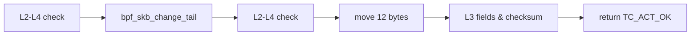
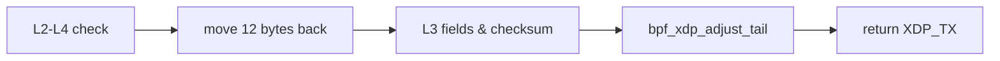

# 基于 XDP 的 UDP 包伪装方案

UDP packet obfuscation based on XDP

主讲人：明宇龙

导师：华蓓

---

# 项目背景

UDP 现状

UDP 在公网的层层 QoS 下表现糟糕，甚至是直接受到阻断

尤其是：劣质家宽、跨运营商访问、跨国访问

---

# 项目背景

上层协议设计

过去主要上层协议大多基于 TCP，甚至是基于 HTTP，例如：

- HTTP/1.1、HTTP/2，经典的 HTTP 是和 TCP 绑定的
- OpenVPN
- RMTP
- HLS、DASH

---

# 项目背景

上层协议设计

一部分主要原因：

- TCP 提供重要的稳定传输
- TCP/HTTP 支持广泛
  - JavaScript 在网络方面只提供 HTTP API

---

# 项目背景

上层协议设计

新一代上层协议开始逐渐发生变化，出现基于 UDP 的上层协议，例如：

- HTTP/3（= HTTP-over-QUIC，QUIC 基于 UDP）
  - 解决队头阻塞问题（多路复用 - 拥塞控制）
  - 支持：Google 主导开发，Cloudflare、Chrome & Firefox 已支持，受 IETF 认可
- WireGuard
  - 轻量、安全、高性能、易配置的新一代 VPN 实现
  - 支持：Linux 5.6 合入主线

---

# 项目背景

UDP-over-TCP 现状

为了保证这些新一代上层协议的正常使用和平滑过渡，此项目和众多现有项目一样实现 UDP-over-TCP

现有 UDP-over-TCP 实现存在问题：

- 性能受限：简单 send UDP via TCP，冗余的内存分配、复制、连接管理，大致限于 100Mbps
  - GOST
- 复用 Linux 网络栈工具：wrap/unwrap 在用户态实现，无法复用功能丰富的 Linux 网络栈
  - tc、netfilter（iptables）、ipset

---

# 项目背景

eBPF

旧 BPF 的增强实现，内核态编程，可编程内核，在 Linux kernel 中运行任意代码

runtime：verifier、JIT、maps、helper API

高性能、最小化内存分配、高灵活度

声明：下文的 BPF 均指 eBPF

---

# 项目背景

eBPF

Linux 网络栈上的 BPF：

- XDP：ingress（入方向），无 skb 分配
- TC BPF：ingress/egress（入出双向）

均可 offload，但仅少数网卡支持

项目选择：XDP ingress，TC BPF egress

---

# BPF 及 XDP 的实现细节

出方向

`int egress(struct __sk_buff *skb)`

---

# BPF 及 XDP 的实现细节

入方向

`int ingress(struct xdp_md *ctx)`

---
layout: center
---

# 谢谢！

