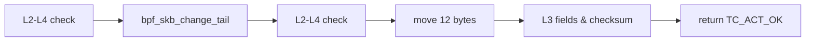
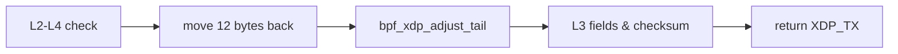

# 基于 XDP 的 UDP 包伪装方案

UDP packet obfuscation based on XDP

主讲人：明宇龙

导师：华蓓

---
layout: center
---

# BPF 及 XDP 的实现细节

接口：Linux API 挂载某份 BPF 代码到某个 NIC 的某个点位，过滤并处理所有经过这个点位的数据包

点位：入方向使用 XDP，出方向使用 TC BPF 的 egress 点位

---

# BPF 及 XDP 的实现细节 - 出方向

`int egress(struct __sk_buff *skb)`

---

# BPF 及 XDP 的实现细节 - 入方向

`int ingress(struct xdp_md *ctx)`

---

# 谢谢！

