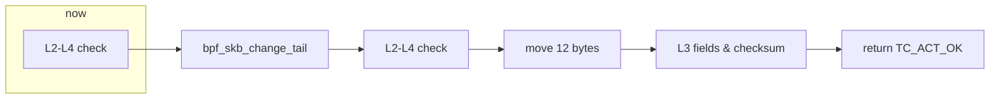
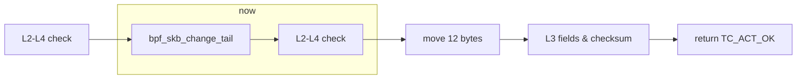
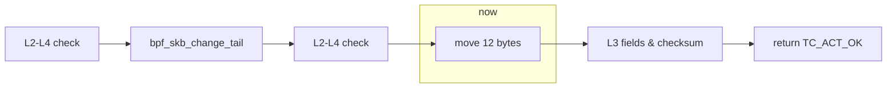
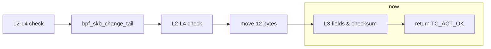
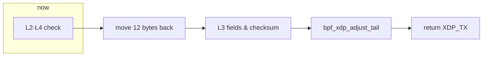
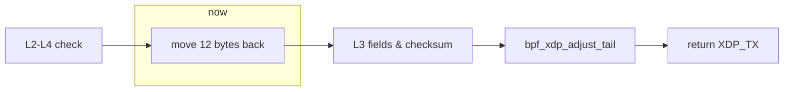
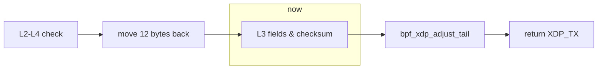
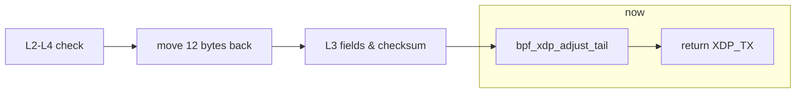
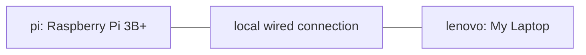

<!-- Copyright (c) 2022 myl7 -->
<!-- SPDX-License-Identifier: CC-BY-NC-ND-4.0 -->

# xdptun:<br>基于 eBPF 的 UDP 包伪装方案

UDP packet obfuscation with eBPF

报告人：明宇龙

导师：华蓓

---

# 项目背景

UDP 现状

UDP 大流量应用在公网的层层 QoS 下表现糟糕，甚至是直接受到阻断

尤其是：劣质家宽、跨运营商访问、跨国访问

- UDP 不保证稳定传输且缺少拥塞控制机制，在网络压力大的情况下，由于缺乏反馈机制，中继节点倾向于直接丢包
- UDP 以往主要承载一些娱乐性和 P2P 流量，对服务质量不敏感，在 QoS 中受到策略的不公平对待
- UDP DRDoS 作为一种常见而强力的 DDoS 类型，进一步压缩了 UDP 大流量应用的生存空间

---

# 项目背景

上层协议设计

过去主要上层协议大多基于 TCP，甚至是进一步基于 HTTP，例如：

- 主导：HTTP（1.1 和 2）
- 文件传输：FTP
- 远程控制：SSH、VNC、RDP（Windows 7 及之前）
- 组网：BGP、OpenVPN
- 视频流：HLS、DASH
- 邮件：SMTP、POP、IMAP
- 直播推流：RMTP
- loT：MQTT

---

# 项目背景

上层协议设计

一部分原因有：

- TCP 的稳定传输简化了上层协议设计，保证了服务质量
- TCP/HTTP 支持广泛，便于上层协议推广
- TCP 特性更丰富，更能满足复杂上层协议的需求

---

# 项目背景

上层协议设计

而新一代上层协议开始逐渐发生变化，出现基于 UDP 的上层协议，例如：

- HTTP/3（= HTTP-over-QUIC，QUIC 基于 UDP）
  - 在 UDP 上实现了稳定传输并包含了强制的 TLS
  - 解决了队头阻塞问题
    - 多路复用与拥塞控制下队头丢包会影响后续包的发送
  - 支持：Google 主导开发，Cloudflare、Chrome 和 Firefox 已有部署，受 IETF 认可
- WireGuard
  - 轻量、安全、高性能、易配置的新一代 VPN 实现
  - 支持：Linux 5.6 合入主线

---

# 项目背景

UDP-over-TCP 现状

在对 UDP 不友好的此环境，为了保证这些新一代上层协议的正常使用和平滑过渡，此项目和众多现有项目一样实现了一套 UDP-over-TCP 方案

但现有 UDP-over-TCP 实现存在问题：

- 性能受限：简单地 send UDP via TCP 有冗余的内存分配、复制、连接管理，大致限于 100Mbps
  - 例如：GOST
- 无法复用 Linux 网络栈工具：wrap/unwrap 在用户态实现，无法复用功能丰富的 Linux 网络栈
  - 具体为 TC、Netfilter（Iptables）、Ipset 等工具

为了解决以上问题，我们选用了 eBPF 来实现一套 UDP-over-pesudo-TCP 方案，通过在 TC BPF 和 XDP 中插入 pesudo-TCP header 来实现 UDP-over-TCP

---

# 项目背景

eBPF

eBPF 允许在 Linux 内核中运行一段用户定义的沙箱代码，从而实现无需重新编译内核的内核态编程

eBPF 由旧的 BPF（cBPF）增强而来

Runtime：

- BPF Verifier：用形式化验证校验程序是否合法，保证 kernel 安全执行
- JIT：解释执行 BPF 指令，但同时保证性能
- Maps：可与用户态程序沟通
- Helper API：`<bpf/bpf_*.h>`

---

# 项目背景

eBPF

优点：

- 高性能
- 可以跳过特定 Linux 部分，从而最小化内存使用
- 高灵活度
- 有安全保证

名词声明：由于旧的 BPF 已增强为 eBPF，下文的 BPF 均指 eBPF，而旧的 BPF 则用 cBPF 指代

---

# 项目背景

eBPF

Linux 网络栈上的 BPF：

- XDP：ingress（入方向），位于网络栈最前端，先于 SKB 分配执行
- TC BPF：ingress/egress（入出双向），位于 TC 前后

均支持 offload，但仅极少数网卡支持

项目选择：XDP ingress、TC BPF egress

---

# BPF 及 XDP 的实现细节

出方向

`int egress(struct __sk_buff *skb)`



`struct __sk_buff *skb` 提供 `void *data` 和 `void *data_end` 访问 frame 数据

从 `void *data` 开始将指针 cast 为 L2 `struct ethhdr *` -> L3 `struct iphdr *` -> L4 `struct udphdr *`，校验边界并依次移进，解析 header 并满足 BPF verifier 要求

截留 L3 为 IP（目前限于 IPv4）= `ETH_P_IP` -> L4 为 UDP = `IPPROTO_UDP` 的包，利用编译选项做进一步 filter（例如基于目标端口），否则直接 `return TC_ACT_OK` 跳过

---

# BPF 及 XDP 的实现细节

出方向



`bpf_skb_change_tail` 扩大 SKB tail 空间以在包末尾添加 12 bytes 并同时 pad 原数据部分至至少 12 bytes（防止 overlapping）

此调用后所有 L2-L4 header pointer invalid，需要重新进行 check

check 过程中，利用 L3 IP header `total length` field 正向获取到原包末尾指针以访问新添加的空间的后 12 bytes 同时满足 verifier 要求：verifier 不允许从 `data_end` 开始移动指针，因为合法的指针范围是 `[data, data_end)` 不含 `data_end`

---

# BPF 及 XDP 的实现细节

出方向



移动 L4 UDP header 后 data 部分前 12 bytes 到包末尾新增空间的后 12 bytes，伪造 TCP header：

```
 0      7 8     15 16    23 24    31
+--------+--------+--------+--------+
|     Source      |   Destination   |
|      Port       |      Port       |
+--------+--------+--------+--------+
|     Length      |    Checksum     |
+--------+--------+--------+--------+
|          data octets ...
+---------------- ...
```

变为：

<style>
pre {
  font-size: 0.8rem;
}
</style>

---

# BPF 及 XDP 的实现细节

出方向


```
 0                   1                   2                   3
 0 1 2 3 4 5 6 7 8 9 0 1 2 3 4 5 6 7 8 9 0 1 2 3 4 5 6 7 8 9 0 1
+-+-+-+-+-+-+-+-+-+-+-+-+-+-+-+-+-+-+-+-+-+-+-+-+-+-+-+-+-+-+-+-+
|      Source Port (kept)       |   Destination Port (kept)     |
+-+-+-+-+-+-+-+-+-+-+-+-+-+-+-+-+-+-+-+-+-+-+-+-+-+-+-+-+-+-+-+-+
|         Sequence Number (Length + Checksum originally)        |
+-+-+-+-+-+-+-+-+-+-+-+-+-+-+-+-+-+-+-+-+-+-+-+-+-+-+-+-+-+-+-+-+
|                    Acknowledgment Number                      |
+-+-+-+-+-+-+-+-+-+-+-+-+-+-+-+-+-+-+-+-+-+-+-+-+-+-+-+-+-+-+-+-+
|  Data |           |U|A|P|R|S|F|                               |
| Offset| Reserved  |R|C|S|S|Y|I|            Window             |
|       |           |G|K|H|T|N|N|                               |
+-+-+-+-+-+-+-+-+-+-+-+-+-+-+-+-+-+-+-+-+-+-+-+-+-+-+-+-+-+-+-+-+
|           Checksum            |         Urgent Pointer        |
+-+-+-+-+-+-+-+-+-+-+-+-+-+-+-+-+-+-+-+-+-+-+-+-+-+-+-+-+-+-+-+-+
|                          data left                            |
+-+-+-+-+-+-+-+-+-+-+-+-+-+-+-+-+-+-+-+-+-+-+-+-+-+-+-+-+-+-+-+-+
```

无可选的 `Options` 及 `Padding`

<style>
pre {
  font-size: 0.8rem;
}
</style>

---

# BPF 及 XDP 的实现细节

出方向



更新 L3 IP header `protocol`、`total length`、`header checksum`

更新 L4 TCP header `data offset`

最后 `return TC_ACT_OK` 结束：

---

# BPF 及 XDP 的实现细节

出方向


关于 checksum：

L3 checksum 由内核完成，此处处理

L4 checksum offload 到 NIC card 完成，此处不需要处理，设为 0 以减少指纹

最后 `return TC_ACT_OK` 结束

---

# BPF 及 XDP 的实现细节

入方向

`int ingress(struct xdp_md *ctx)`



`struct xdp_md *ctx` 依然提供 `void *data` 和 `void *data_end` 访问 frame 数据，但是没有 SKB 的相关协议支持

校验边界、依次移进、解析 header、满足 verifier 要求的过程与出方向的大致相同

截留 L3 为 IP（目前限于 IPv4）= `ETH_P_IP` -> L4 为 TCP = `IPPROTO_TCP` 的包，同样利用编译选项做进一步 filter，否则直接 `return XDP_PASS` 跳过

---

# BPF 及 XDP 的实现细节

入方向



同样地利用 L3 IP header `total length` field 正向获取到包末尾指针访问尾 12 bytes 恢复到 TCP header 内对应位置：

```
 0                   1                   2                   3
 0 1 2 3 4 5 6 7 8 9 0 1 2 3 4 5 6 7 8 9 0 1 2 3 4 5 6 7 8 9 0 1
+-+-+-+-+-+-+-+-+-+-+-+-+-+-+-+-+-+-+-+-+-+-+-+-+-+-+-+-+-+-+-+-+
|      Source Port (kept)       |   Destination Port (kept)     |
+-+-+-+-+-+-+-+-+-+-+-+-+-+-+-+-+-+-+-+-+-+-+-+-+-+-+-+-+-+-+-+-+
|         Sequence Number (Length + Checksum originally)        |
+-+-+-+-+-+-+-+-+-+-+-+-+-+-+-+-+-+-+-+-+-+-+-+-+-+-+-+-+-+-+-+-+
|                    Acknowledgment Number                      |
+-+-+-+-+-+-+-+-+-+-+-+-+-+-+-+-+-+-+-+-+-+-+-+-+-+-+-+-+-+-+-+-+
|  Data |           |U|A|P|R|S|F|                               |
| Offset| Reserved  |R|C|S|S|Y|I|            Window             |
|       |           |G|K|H|T|N|N|                               |
+-+-+-+-+-+-+-+-+-+-+-+-+-+-+-+-+-+-+-+-+-+-+-+-+-+-+-+-+-+-+-+-+
|           Checksum            |         Urgent Pointer        |
+-+-+-+-+-+-+-+-+-+-+-+-+-+-+-+-+-+-+-+-+-+-+-+-+-+-+-+-+-+-+-+-+
|                          data left                            |
+-+-+-+-+-+-+-+-+-+-+-+-+-+-+-+-+-+-+-+-+-+-+-+-+-+-+-+-+-+-+-+-+
```

<style>
pre {
  font-size: 0.8rem;
}
</style>

---

# BPF 及 XDP 的实现细节

入方向



仅更新 L3 IP header `protocol`、`total length`、`header checksum`

L4 TCP header 只保留 checksum，其余部分丢弃，利用 TCP checksum 恢复 UDP checksum

---

# BPF 及 XDP 的实现细节

入方向



`bpf_xdp_adjust_tail` 收缩 tail 空间以移除包末尾的 12 bytes 同时移除 pad 的空间

BUG：树莓派 Linux Kernel 中 NIC card driver 未设置 `frame_sz` field

最后 `return XDP_PASS` 让包进入 Linux 网络栈

---

# 性能测试

HTTP/1.0 over WireGuard over xdptun



- Hostname: lenovo
  - Machine Type: Yoga Slim 7 Pro-14ACH5 Laptop (ideapad) - Type 82MS
    - [Spec](https://pcsupport.lenovo.com/us/en/products/laptops-and-netbooks/yoga-series/yoga-slim-7-pro-14ach5/82ms/82ms0000cd/pf2p5rrf)
  - Wired Network: 1000Mbps
  - OS: Arch Linux
  - Kernel Version: 5.16.14-arch1-1
- Hostname: pi
  - Machine Type: Raspberry Pi 3 Model B+
    - [Spec](https://www.raspberrypi.com/products/raspberry-pi-3-model-b-plus/)
  - Wired Network: 300Mbps over USB 2.0
  - OS: Raspberry Pi OS (64-bit)
    - Debian version: 11 (bullseye)
  - Kernel Version: 5.15.28-v8+
  - Power: By USB of lenovo
- Network: Connected locally over wired connection

---

# 性能测试

HTTP/1.0 over WireGuard over xdptun

`Speed` means average download speed reported by cURL, and uses uint MiB/s

| Protocols                           | Speed 1 | Speed 2 | Speed 3 | Average Speed | CPU Usage |
| ----------------------------------- | ------- | ------- | ------- | ------------- | --------- |
| HTTP/1.0                            | 15.1    | 14.8    | 15.0    | 15.0          | Medium    |
| HTTP/1.0 over WireGuard             | 10.8    | 11.0    | 10.9    | 10.9          | High      |
| HTTP/1.0 over WireGuard over xdptun | 9.80    | 9.80    | 9.80    | 9.80          | Higher    |

- WireGuard 对于树莓派而言太重，CPU 是瓶颈
- 在这种 CPU 为瓶颈的环境下，由于 xdptun 造成的额外压力，throughput 会下降约 10%

---

# 性能测试

HTTP/3 over xdptun

- WireGuard 对于树莓派而言太重，CPU 是瓶颈
- 在这种 CPU 为瓶颈的环境下，由于 xdptun 造成的额外压力，throughput 会下降约 10%

---
layout: center
---

# 谢谢！

<style>
h1 {
  font-size: 3.75rem !important;
}
</style>
