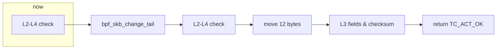
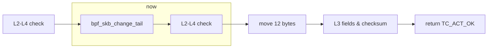
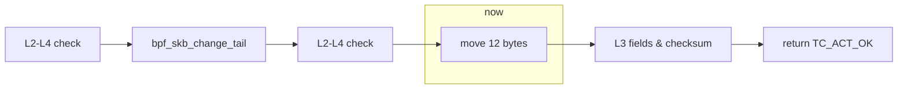
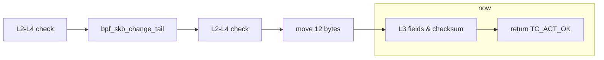
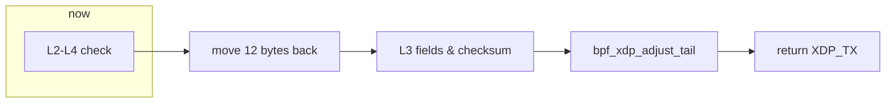
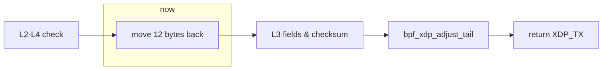
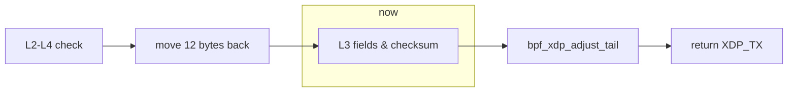
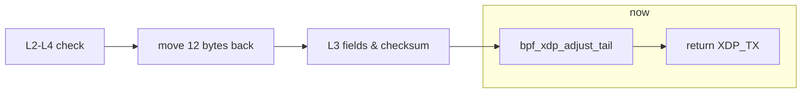

<!-- Copyright (c) 2022 myl7 -->
<!-- SPDX-License-Identifier: CC-BY-NC-ND-4.0 -->

# 基于 XDP 的 UDP 包伪装方案

UDP packet obfuscation based on XDP

主讲人：明宇龙

导师：华蓓

---

# 项目背景

UDP 现状

UDP 在公网的层层 QoS 下表现糟糕，甚至是直接受到阻断

尤其是：劣质家宽、跨运营商访问、跨国访问

---

# 项目背景

上层协议设计

过去主要上层协议大多基于 TCP，甚至是基于 HTTP，例如：

- HTTP/1.1、HTTP/2，经典的 HTTP 是和 TCP 绑定的
- OpenVPN
- RMTP
- HLS、DASH

---

# 项目背景

上层协议设计

一部分主要原因：

- TCP 提供重要的稳定传输
- TCP/HTTP 支持广泛
  - JavaScript 在网络方面只提供 HTTP API

---

# 项目背景

上层协议设计

新一代上层协议开始逐渐发生变化，出现基于 UDP 的上层协议，例如：

- HTTP/3（= HTTP-over-QUIC，QUIC 基于 UDP）
  - 解决队头阻塞问题（多路复用 - 拥塞控制）
  - 支持：Google 主导开发，Cloudflare、Chrome & Firefox 已支持，受 IETF 认可
- WireGuard
  - 轻量、安全、高性能、易配置的新一代 VPN 实现
  - 支持：Linux 5.6 合入主线

---

# 项目背景

UDP-over-TCP 现状

为了保证这些新一代上层协议的正常使用和平滑过渡，此项目和众多现有项目一样实现 UDP-over-TCP

现有 UDP-over-TCP 实现存在问题：

- 性能受限：简单 send UDP via TCP，冗余的内存分配、复制、连接管理，大致限于 100Mbps
  - GOST
- 复用 Linux 网络栈工具：wrap/unwrap 在用户态实现，无法复用功能丰富的 Linux 网络栈
  - tc、netfilter（iptables）、ipset

---

# 项目背景

eBPF

旧 BPF 的增强实现，内核态编程，可编程内核，在 Linux kernel 中运行任意代码

runtime：verifier、JIT、maps、helper API

高性能、最小化内存分配、高灵活度

声明：下文的 BPF 均指 eBPF

---

# 项目背景

eBPF

Linux 网络栈上的 BPF：

- XDP：ingress（入方向），无 SKB 分配
- TC BPF：ingress/egress（入出双向）

均可 offload，但仅少数网卡支持

项目选择：XDP ingress，TC BPF egress

---

# BPF 及 XDP 的实现细节

出方向

`int egress(struct __sk_buff *skb)`



`struct __sk_buff *skb` 提供 `void *data` 和 `void *data_end`

从 `void *data` 开始将指针 cast 为 L2 `struct ethhdr *` -> L3 `struct iphdr *` -> L4 `struct udphdr *`，校验边界并依次移进，解析 header 并满足 verifier 要求

截留 L3 为 IP（目前限于 IPv4）= `ETH_P_IP` -> L4 为 UDP = `IPPROTO_UDP` 的包，否则直接 `return TC_ACT_OK` 跳过

---

# BPF 及 XDP 的实现细节

出方向



`bpf_skb_change_tail` 扩大 SKB tail 空间以在包末尾添加 12 bytes 并同时 pad 原数据部分至至少 12 bytes（防止 overlapping）

此调用后所有 L2-L4 header pointer invalid，需要重新进行 check

check 过程中，利用 L3 IP header `total length` field 正向获取到原包末尾指针以访问新添加的空间的后 12 bytes 同时满足 verifier 要求：verifier 不允许从 `data_end` 开始移动指针，因为合法的指针范围是 `[data, data_end)` 不含 `data_end`

---

# BPF 及 XDP 的实现细节

出方向



移动 L4 UDP header 后 data 部分前 12 bytes 到包末尾新增空间的后 12 bytes，伪造 TCP header：

```
 0      7 8     15 16    23 24    31
+--------+--------+--------+--------+
|     Source      |   Destination   |
|      Port       |      Port       |
+--------+--------+--------+--------+
|     Length      |    Checksum     |
+--------+--------+--------+--------+
|          data octets ...
+---------------- ...
```

变为：

<style>
pre {
  font-size: 0.8rem;
}
</style>

---

# BPF 及 XDP 的实现细节

出方向


```
 0                   1                   2                   3
 0 1 2 3 4 5 6 7 8 9 0 1 2 3 4 5 6 7 8 9 0 1 2 3 4 5 6 7 8 9 0 1
+-+-+-+-+-+-+-+-+-+-+-+-+-+-+-+-+-+-+-+-+-+-+-+-+-+-+-+-+-+-+-+-+
|      Source Port (kept)       |   Destination Port (kept)     |
+-+-+-+-+-+-+-+-+-+-+-+-+-+-+-+-+-+-+-+-+-+-+-+-+-+-+-+-+-+-+-+-+
|         Sequence Number (Length + Checksum originally)        |
+-+-+-+-+-+-+-+-+-+-+-+-+-+-+-+-+-+-+-+-+-+-+-+-+-+-+-+-+-+-+-+-+
|                    Acknowledgment Number                      |
+-+-+-+-+-+-+-+-+-+-+-+-+-+-+-+-+-+-+-+-+-+-+-+-+-+-+-+-+-+-+-+-+
|  Data |           |U|A|P|R|S|F|                               |
| Offset| Reserved  |R|C|S|S|Y|I|            Window             |
|       |           |G|K|H|T|N|N|                               |
+-+-+-+-+-+-+-+-+-+-+-+-+-+-+-+-+-+-+-+-+-+-+-+-+-+-+-+-+-+-+-+-+
|           Checksum            |         Urgent Pointer        |
+-+-+-+-+-+-+-+-+-+-+-+-+-+-+-+-+-+-+-+-+-+-+-+-+-+-+-+-+-+-+-+-+
|                          data left                            |
+-+-+-+-+-+-+-+-+-+-+-+-+-+-+-+-+-+-+-+-+-+-+-+-+-+-+-+-+-+-+-+-+
```

无可选的 `Options` 及 `Padding`

<style>
pre {
  font-size: 0.8rem;
}
</style>

---

# BPF 及 XDP 的实现细节

出方向



更新 L3 IP header `protocol`、`total length`、`header checksum`

更新 L4 TCP header `data offset`、`checksum`

最后 `return TC_ACT_OK` 结束：

<style>
pre {
  font-size: 0.8rem;
}
</style>

---

# BPF 及 XDP 的实现细节

入方向

`int ingress(struct xdp_md *ctx)`



`struct xdp_md *ctx` 依然提供 `void *data` 和 `void *data_end`，但是没有 SKB 的相关协议支持

校验边界、依次移进、解析 header、满足 verifier 要求的过程与出方向的大致相同

截留 L3 为 IP（目前限于 IPv4）= `ETH_P_IP` -> L4 为 TCP = `IPPROTO_TCP` 的包，否则直接 `return XDP_PASS` 跳过

---

# BPF 及 XDP 的实现细节

入方向



同样地利用 L3 IP header `total length` field 正向获取到包末尾指针访问尾 12 bytes 恢复到 TCP header 内对应位置：

```
 0                   1                   2                   3
 0 1 2 3 4 5 6 7 8 9 0 1 2 3 4 5 6 7 8 9 0 1 2 3 4 5 6 7 8 9 0 1
+-+-+-+-+-+-+-+-+-+-+-+-+-+-+-+-+-+-+-+-+-+-+-+-+-+-+-+-+-+-+-+-+
|      Source Port (kept)       |   Destination Port (kept)     |
+-+-+-+-+-+-+-+-+-+-+-+-+-+-+-+-+-+-+-+-+-+-+-+-+-+-+-+-+-+-+-+-+
|         Sequence Number (Length + Checksum originally)        |
+-+-+-+-+-+-+-+-+-+-+-+-+-+-+-+-+-+-+-+-+-+-+-+-+-+-+-+-+-+-+-+-+
|                    Acknowledgment Number                      |
+-+-+-+-+-+-+-+-+-+-+-+-+-+-+-+-+-+-+-+-+-+-+-+-+-+-+-+-+-+-+-+-+
|  Data |           |U|A|P|R|S|F|                               |
| Offset| Reserved  |R|C|S|S|Y|I|            Window             |
|       |           |G|K|H|T|N|N|                               |
+-+-+-+-+-+-+-+-+-+-+-+-+-+-+-+-+-+-+-+-+-+-+-+-+-+-+-+-+-+-+-+-+
|           Checksum            |         Urgent Pointer        |
+-+-+-+-+-+-+-+-+-+-+-+-+-+-+-+-+-+-+-+-+-+-+-+-+-+-+-+-+-+-+-+-+
|                          data left                            |
+-+-+-+-+-+-+-+-+-+-+-+-+-+-+-+-+-+-+-+-+-+-+-+-+-+-+-+-+-+-+-+-+
```

<style>
pre {
  font-size: 0.8rem;
}
</style>

---

# BPF 及 XDP 的实现细节

入方向



仅更新 L3 IP header `protocol`、`total length`、`header checksum`

L4 TCP header 直接丢弃，L4 UDP header 并未修改保留即可

<style>
pre {
  font-size: 0.8rem;
}
</style>

---

# BPF 及 XDP 的实现细节

入方向



`bpf_xdp_adjust_tail` 收缩 tail 空间以移除包末尾的 12 bytes 同时移除 pad 的空间

最后 `return XDP_PASS` 让包进入 Linux 网络栈

---
layout: center
---

# 谢谢！

<style>
h1 {
  font-size: 3.75rem !important;
}
</style>
